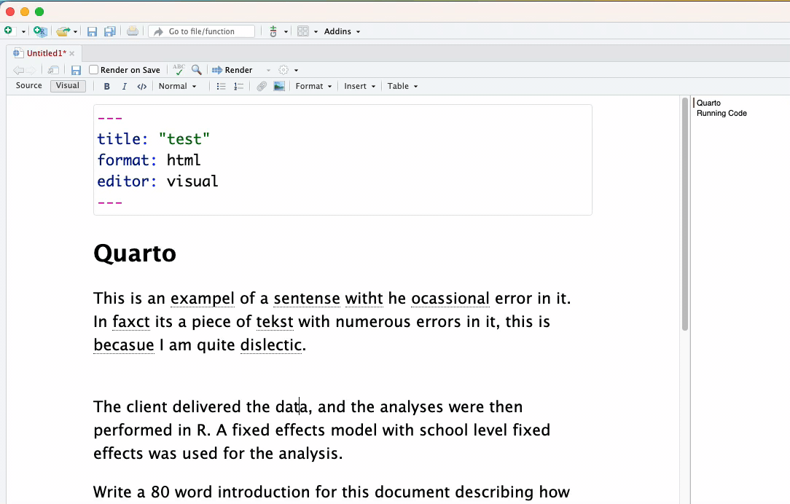

# GPTstudio

GPT addins for Rstudio, **read the privacy note at the bottom, this is alpha software there is no warranty for anything.**

### Prerequisite

1. make and openai.com account (free one will do for now)

2. generate an API key to use openai from Rstudio: https://beta.openai.com/account/api-keys

3. set the API key uyp in Rstudio in one of two ways:

By default, functions of openai will look for OPENAI_API_KEY environment variable. If you want to set a global environment variable, you can use the following command (where xxxxxxxxxxxxxxxxxxxxxxxxxxxxxxxxxxxxxxxxxxxxxxxxxxx should be replaced with your actual key):

```
Sys.setenv(
    OPENAI_API_KEY = 'xxxxxxxxxxxxxxxxxxxxxxxxxxxxxxxxxxxxxxxxxxxxxxxxxxx'
)
```

Otherwise, you can add the key to the .Renviron file of the project. The following commands will open .Renviron for editing:

```
if (!require(usethis))
    install.packages("usethis")

usethis::edit_r_environ(scope = "project")
You can add the following line to the file (again, replace xxxxxxxxxxxxxxxxxxxxxxxxxxxxxxxxxxxxxxxxxxxxxxxxxxx with your actual key):


OPENAI_API_KEY=xxxxxxxxxxxxxxxxxxxxxxxxxxxxxxxxxxxxxxxxxxxxxxxxxxx
```

Note: If you are using GitHub/Gitlab, do not forget to add .Renviron to .gitignore!


## install the addins from this package:

simply install:

```
require(devtools)
install_github("MichelNivard/GPTstudio")
```

### useage:

 Some examples of use.
 
### Spelling ang grammar check

**Addins > GPTSTUDIO > Spelling and Grammar:** Takes the selected text sends it to openai's best model and instructs it to return a spelling and grammar checked version. 



#### Active voice:

**Addins > GPTSTUDIO > Change text to active voice:** Takes the selected text sends it to openai's best model and instructs it to return the text in  the active voice. 


#### Write/code from prompt

**Addins > GPTSTUDIO > Write/Code from prompt:** Takes the selected text sends it to openai's as a prompt for the model to work with, this is most like the ChatGPT experience.

Text from prompt:


Code from prompt:


**Privacy note:** these functions work by taking the text or code you have highlighted/selected with the cursor and send these to openai as part of a prompt, they fall under their privacy notice/rules/exceptions you agreed to with openai when making an account. I do not know how secure thesse are when send to openai, I also don't know what openai does with them. The code is designed to ONLY share the highlighted/selected text and no other elements of your R environment (i.e. data) unless you have highlighted it when running the addin. This may limit usability for now, but I dont want people to eccidentally send sensitive data to openai over the internet. 

DO NOT HIGHLIGHT, AND THEREFORE UPLOAD, DATA/CODE/TEXT THAT SHOULD REMAIN PRIVATE. 
