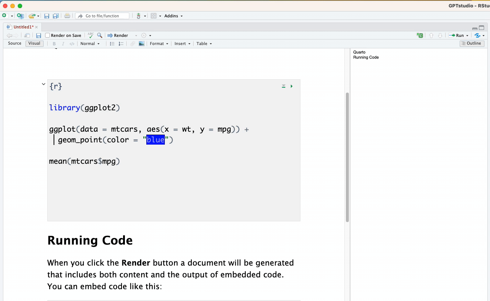

<!-- README.md is generated from README.Rmd. Please edit that file -->
<!-- badges: start -->

[](https://lifecycle.r-lib.org/articles/stages.html#experimental)
[](https://CRAN.R-project.org/package=GPTstudio)
[](https://github.com/JamesHWade/GPTstudio/actions/workflows/R-CMD-check.yaml)
[](https://app.codecov.io/gh/JamesHWade/GPTstudio?branch=main)
<!-- badges: end -->

The goal of gptstudio is for R programmers to easily incorporate use of
large language models (LLMs), specifically for now GPT variants developed by OpenAI, into their project workflows. These models
appear to be a step change in our use of text for knowledge work, but
you should carefully consider ethical implications of using these
models. Ethics of LLMs (also called [Foundation
Models](https://arxiv.org/abs/2108.07258)) is an area of very active
discussion.

**read the privacy note at the bottom, this is alpha software there is
no warranty for anything.**

## Prerequisites

1.  Make an OpenAI account. As of now, the free one will do.

2.  [Create an OpenAI API key](https://beta.openai.com/account/api-keys)
    to use `{openai}` package within Rstudio

3.  Set the API key up in Rstudio in one of two ways:

- By default, functions of `{openai}` will look for `OPENAI_API_KEY`
  environment variable. If you want to set a global environment
  variable, you can use the following command, where `"<APIKEY>"` should
  be replaced with your actual key:

``` r
Sys.setenv(OPENAI_API_KEY = "<APIKEY>")
```

- Alternatively, you can set the key in your .Renviron file.

Otherwise, you can add the key to the .Renviron file of the project. The
following commands will open .Renviron for editing:

``` r
require(usethis)
edit_r_environ(scope = "project")
```

You can add the following line to the file (again, replace
`"<APIKEY>"` with your actual
key):

``` bash
OPENAI_API_KEY="<APIKEY>"
```

This now set the API key every time you start up this particular
project. Note: If you are using GitHub/Gitlab, do not forget to add
.Renviron to .gitignore!

## Install the addins from this package:

``` r
require(devtools)
install_github("MichelNivard/GPTstudio")
```

## Usage

Some examples of use.


### Spelling ang grammar check

**Addins \> GPTSTUDIO \> Spelling and Grammar:** Takes the selected text
sends it to OpenAI’s best model and instructs it to return a spelling
and grammar checked version.


### Freeform GPT editor

**Addins \> GPTSTUDIO \> Freeform GPT editor:** Apply any edit what YOU
desire or can dream up to a selection of code or text. Here it's shown translating a famous French poem by Victor Hugo.


### Active voice

**Addins \> GPTSTUDIO \> Change text to active voice:** Takes the
selected text sends it to OpenAI’s best model and instructs it to return
the text in the active voice.


### Write/code from prompt

**Addins \> GPTSTUDIO \> Write/Code from prompt:** Takes the selected
text and sends it to OpenAI as a prompt for the model to work with. This
is most like the ChatGPT experience.

Text from prompt:


Code from prompt:


### Comment your code:

**Addins \> GPTSTUDIO \> Comment your code:** Takes the selected text
sends it to OpenAI as a prompt for a code specific model to work with,
asks for a version with a comment added explaining the code line by
line.




**Privacy note:** these functions work by taking the text or code you
have highlighted/selected with the cursor and send these to OpenAI as
part of a prompt, they fall under their privacy notice/rules/exceptions
you agreed to with OpenAI when making an account. I do not know how
secure these are when sent to OpenAI, I also don’t know what OpenAI does
with them. The code is designed to ONLY share the highlighted/selected
text and no other elements of your R environment (i.e. data) unless you
have highlighted it when running the addin. This may limit usability for
now, but I do not want people to accidentally share sensitive data with
OpenAI.

DO NOT HIGHLIGHT, AND THEREFORE UPLOAD, DATA/CODE/TEXT THAT SHOULD
REMAIN PRIVATE.
